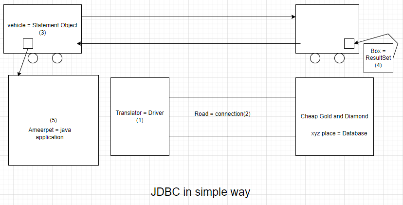
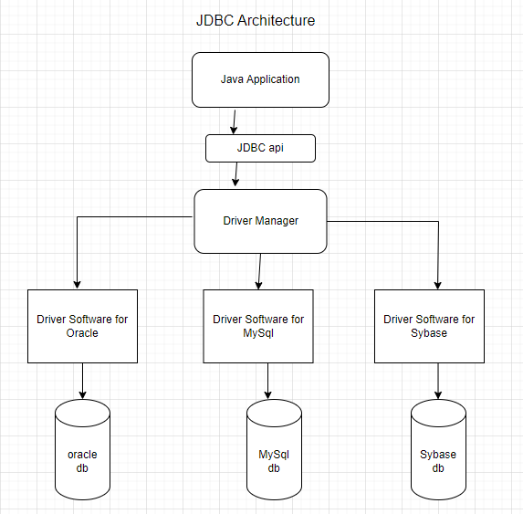
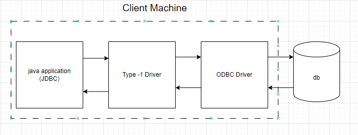
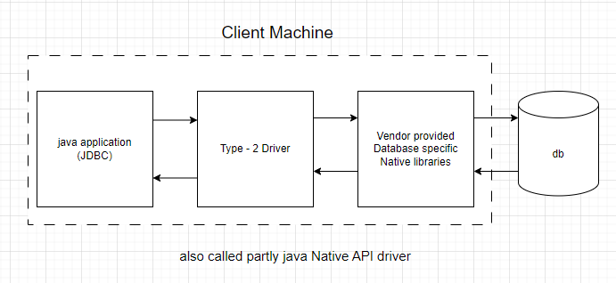
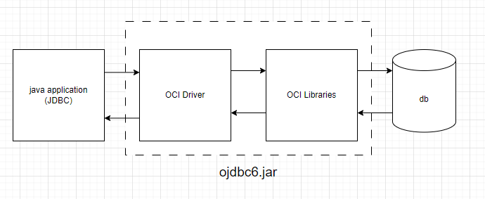
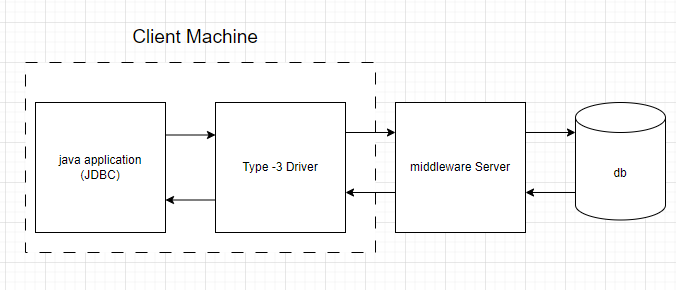
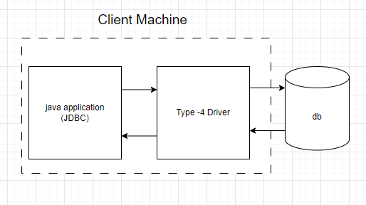

## Introduction to Advance Java

### JSP

It is for `presentation logic`.

### Servlet

it is for `processing logic`. e.g

1. Read data
2. process data
3. compare data with database etc

### JDBC

It is used for communication with the `database` from java application. we will be discussing

1. JDBC version 4.2v
2. Servlets version 3.1v
3. JSPs 2.3v

## JDBC in simple way



- `Ameerpet = javaapplication`
- `xyz place = database`
- `Translator = Driver`
- `Road = connection`
- `vehicle = Statement object` is the vehicle which is used to send the queries from `java application` to the `database` and back.
- `box = ResultSet` is the box which will get the results from database and then stays in the vehicle to be transfered back.

## JDBC in simple way part 2

### Standard step to develop JDBC program

1. load and register `driver = translator`.
2. Establish `connection = road` between `java application` and `database`
3. Creation of `statement object = vehicle`.
4. Send and execute `SQL queries`.
5. process result from `ResultSet = box`.
6. close the `connection = road`

### Writing a simple program for JDBC

1. first create a `database`. download `developer` version from this link `https://www.microsoft.com/en-us/sql-server/sql-server-downloads` install it.
2. download `SSMS studio` alongwith from this link and install it `https://learn.microsoft.com/en-us/sql/ssms/download-sql-server-management-studio-ssms?redirectedfrom=MSDN&view=sql-server-ver15`. it will give the the graphical view. we can add `databases` in it.
3. in commandline we can use these command

```
-----> sqlcmd -s localhost -e
1> select name from master.sys.databases
2> go
```

we will see all the databases then

```
1> use durga_jdbc_database
2> go
Changed database context to 'durga_jdbc_database'.
1> SELECT * from Employee
2> go
SELECT * from Employee

ENO        lENAME                                             lESAL       lEADDR
-----------l--------------------------------------------------l-----------l--------------------------------------------------
        100lDurga                                             l       1000lHyd
        200lBunny                                             l       2000lMumbai
        300lSunny                                             l       3000lHyd
        400lChinny                                            l       4000lChennai

(4 rows affected)
1>
```

down below is a simple program. some terms which is not clear will be discussed later.

```
import java.sql.*;
public class JdbcDemo
{
  public static void main(String [] args) throw Exception{
    Class.forName("oracle.jdbc.OracleDriver"); // load and register driver
    Connection con = DriverManager.getConnection("jdbc:oracle:thin:@localhost:1521:XE", "username", "password"); // establish connection
    Statement st = con.createStatement(); // creation of statement object
    ResultSet rs = st.executeQuery("select * from Employee"); // creation of ResultSet
    while(rs.next()){
      System.out.println(rs.getInt(1)+ "---"+rs.getString(2)+"---"+rs.getDouble(3)) // process resultset
    }
    con.close(); // end connection
  }
}
```

## Storage Areas

1. Temporary Storage Areas
2. Permanent Storage Areas

### Permanent Storage Areas

some of the permanent storage areas are

- File System
- Database
- Dataware houses
- BigData Hadoop

### FileSystem issues

- huge amount problem
- security
- No QL support
- no mechanism to prevent duplicates, chances of data inconsistency

### Database

Database will tackle the above issues

### limitation of Databases

- we cannot store very huge amount of data
- we can store only stractural data

## JDBC

jdbc is a specification provided by Java Vendor (Sun enterprise). Implementation is provided by Database vendor. That implementation is called `Driver Software`.

## JDBC Features

1. Standard API (connection, statement, result etc all is same). It is a Database independent API. from database to database it will not change much.
2. It is platform independent also because it is developed in Java.
3. we can implement CRUD operation easily with JDBC
4. http://www.oracle.com/technetwork/java/index-136695.html companies using JDBC and supporting it.

## JDBC Version

in Java 1.1 (java SE 1.1) => JDBC 1.0 version
in Java 1.4 (java SE 1.4) => JDBC 3.0 version
in Java 5 (java SE 5) => No update in JDBC
in Java 6 (java SE 6) => JDBC 4.0 version
in Java 7 (java SE 7) => JDBC 4.1 version
in Java 8 (java SE 8) => JDBC 4.2 version

## Evolution of JDBC

before developing applications with C/C++ we have to use database specific libraries in our application directly so applications were database dependent. for that reason Microsoft develop the `ODBC (open database connectivity) technology` in 1992.

- with ODBC application can communicate with any databasse, just by selecting corresponding ODBC driver.

## ODBC limitation

- it work for `windows machine only`
- so if we use this than Java will not be platform independent.
- ODBC is developed in C language so interacting with Java application will decrease the performance.

for that reason JDBC came into picture in 1997 by Sun Microsystem.

## JDBC Architecture

JDBC API provides DriverManager to the Java Application

### Driver Manager


Driver Manager is a class present in `java.sql` package. it is used to manage all the Driver software for example for `oracle`, `mySql` etc internally.

Driver Manager class contain some of these methods

1. DM.registerDriver(driver);
2. DM.unregisterDriver(driver);
3. Connection con = DM.getConnection(jdbcURL, username, password);

### Database Driver

- it is very important component of JDBC Architecture
- Without driver software we can't touch database
- it act as a bridge between java application and database.
- it is responsible to convert java calls into database specific calls and database specific calls into java calls.
- Driver is database dependent and java application is independent

## JDBC API

JDBC api define several classes and interfaces which can be used for database communication.

### who is using JDBC API

1. Programmer
2. Driver Software Vendor for each database

### JDBC API packages

1. `java.sql package` which contains the most basic classes and interfaces for interacting with db.
2. `javax.sql package` which contains more extended classes and interfaces and gives more functionalities for interacting with db. like `connection polling etc`.

## Driver Software

programmer are not responsible for the implementation of the interfaces present in JDBC api packages. Driver software vendors are responsible for its implementation.

- in Driver Software we have multiple classes one specific class is `Driver class` which is used for the identification of `Driver Software`. it is the implementation class of `java.sql.Driver`

### Type-1 Driver by SUN

Type-1 Driver is provided by the SUN microsystem as a part of JDK. The class name for it is `sun.jdbc.odbc.jdbcodbcDriver`

### Type-4 (Thin) Driver

it is provided by oracle. the class name is `oracle.jdbc.oracleDriver(c)` which is implementing `java.sql.Driver(I)` which is a part of `jdbc api`.

### Driver Software availibility

- `Driver software` are usually available in the form of `jar files`. `jar files` contains a group of `class files`. jar mean `java archive files`

1. `ojdbc6.jar` ---> `oracle 11g`
2. `ojdbc7.jar` ---> `oracle 12c`
3. `ojdbc14.jar` ---> `oracle 10g`

for mysql

- `mysql-connector.jar`

### Driver Software providers

1. java vendor ---> type1-Driver (depreceted)
2. Database vendor --> Thin Driver for oracle
3. 3rd party vendors --> Inet - oraxo

### Pure Java Driver

only java is used for developing the Driver software

### Partial java Driver

java + other languages (C and C ++)

## Types of JDBC Drivers are available

Thousands of Driver are available but all of them are divided into 4 Types.

1. Type - 1 Driver (JDBC - ODBC Bridge Driver or Bridge Driver)
2. Type - 2 Driver (Native Api - partly java Driver or Native Driver)
3. Type - 3 Driver (All Java Net protocol Driver or Network protocol Driver or Middleware driver)
4. Type - 4 Driver (pure java Driver or Native protocol driver or thin driver)

## Type - 1 Driver



- from converting `JDBC calls` to `ODBC calls`, `Type - 1 Driver` is used. This driver act as bridge. so it is also called `JDBC - ODBC Bridge Driver or Bridge Driver`.
- it come as part of JDK provided by SUN
- we are not required to install anything. we can use it internally.

### Advantages of Type - 1 driver

1. no separate installation
2. very easy to use
3. it is database independent driver because it is communicating with `ODBC Driver`.

### limitation of Type -1 Driver

1. snail driver because 2 times conversion.
2. depends on ODBC Driver so only for windows machine. platform independent nature is missed.
3. support is available until 1.7 version

## Type - 2 Driver

it is exactly same as `Type - 1` except some small difference.



- from `JDBC` to `Vendor provided database specific Native libraries`
- it is also known as `Native API partly java driver`.
- we have to install vendor provided native libraries on the cient machine.
- type 2 driver converts jdbc calls into vendor specific native library calls, which can be understanable directly by the database engine.

### Advantages of Type - 2 driver

1. one conversion so it is speed driver
2. no ODBC support
3. portability is more (separate Type -2 driver for windows, linux, mac etc)

### limitations of Type -2 driver

1. it is database depended and platform depended. Therefore migration from one database to other will be difficult.
2. we have to change the driver if we are changing `database` or if we are changing `platform`.
3. No guarantee that database vendor provide native libraries.

## OCI driver



- it is `Type - 2 driver`. provided by oracle.
- OCI driver internally uses OCI libraries which is written in C language.
- OCI driver + OCI libraries are provided as jar file
- Ojdbc14.jar ----> oracle 10g (internally uses java 1.4v)
- Ojdbc6.jar ---> oracle 11g (internally uses java 6v)
- ojdbc7.jar ---> oracle 12c (internally uses java 7v)

## Type - 3 Driver



- `Type - 1`, and `Type - 2` are not recommended to use because of the limitation as discussed.
- also known as `All java net protocol driver or network protocol driver or middleware driver`
- Type - 3 driver converts JDBC calls into middleware server specific calls. middleware server converts middleware specific calls into database specific calls.
- internally middleware server uses Type -1 , Type -2, and Type - 4 drivers to communicate with database.
- for example `IDS(Internet database Access Server)` is a Type - 3 driver which a both platform and database independent.

### Advantages

1. it won't communicate directly with db
2. it is platform independent
3. no need of ODBC driver or vendor specific native libraries.

### limitations

1. performance is a bit slow
2. cost is more to purchase middleware server.

## Type - 4 Driver



- also known as `pure java driver` or `All java native protocol driver` or `thin driver`
- This Driver uses Database specific Native protocols to communicate with database.
- The Driver converts JDBC calls into Database specific calls directly
- This driver is developed only in java hence platform independent
- This driver won't require any ODBC Driver or native libraries at client side and hence it is called `Thin Driver`.

### Advantage

1. it is platform independent Driver.
2. it won't require ODBC Driver or native libraries or middleware Server.
3. it uses database vendor specific native protocol to communicate with database and hence security is more.
4. performance is more

### limitations

1. database dependent driver

example of this driver is `oracle connector for mysql`

## which database we should use

1. if we are not changing the database use `Type - 4` driver. it is good for `standalone` and `small scale applications`.
2. if working with multiple databases use `type -3` driver. it is used for large scale web applications and enterprise application.

## Difference between thin and thick driver

### Thick Driver

Type - 1, 2, 3 are thick driver. if some extra component is required between The driver and database such type of driver are thick drivers

### Thin Driver

Type - 4 is a thin driver

## Tier of Drivers

- Type - 1 ---> tier 2 archeticture
- Type - 2 ---> tier 2 archeticture
- Type - 3 ---> tier 3 archeticture
- Type - 4 ---> tier 2 archeticture

## Steps to develop JDBC Application

1. Load and Register `Driver Class`.
2. Establish connection between `Java application` and `database`.
3. Create `Statement Object = vehicle`.
4. Send and execute SQL Query.
5. Process Result from `ResultSet`.
6. close connection.

### 1. Load and Register Driver Class

To load and register `Driver class` we need `Driver Software` which is available to us in the form of `jar files`. we have to provide those `jar files` in the class path.
first line we have to provide is

```
Class.forName("sun.jdbc.odbc.jdbcodbcDriver")
```

so what is happen essentially in normal java whenever we are loading a class `the static block is executed`. so if we check this concept with a simple program.

```
class Student{
  static{
    System.out.println("This is the static block of Student Class");
  }
}

class Test{
  public static void main(String [] args) throws Exception{
    Class.forName("Student");
  }
}
```

the output is

```
This is the static block of Student Class
```

so the same thing is happening here also.

```
Class.forName("sun.jdbc.odbc.jdbcodbcDriver")
```

internally there is a static block inside `JdbcOdbcDriver class` which will execute. which is something like this. the static block is going to register the driver.

```
class JdbcOdbcDriver{
  static{
    JdbcOdbcDriver driver = new JdbcOdbcDriver();
    Drivermanager.registerDriver(driver);
  }
}
```

for when we are loading the driver automatically getting registered.

- if we want to see that class, so for `Type 1` driver we have it integrated in JDK. so we go to the path `JDK/JRE/lib/rt.jar` we extract this jar files and with `decompiler` decompiles the `.class` file. for that we have to install the decompiler.

### Note

- from `java 1.6v/JDBC 4.0V` onwards we don't need to load and register driver. the `JVM` will automatically load and register it from the `CLASSPATH`. and we will be using JDBC 4.2.

## step 2. Establish connection between Java Application and Database

- to establish connection `DriverManager` has a method called `getConnection` which will requir some values inorder to connect java application to database. these values are

1. jdbc URL
2. username
3. password

same like gmail we need a URL `www.gmail.com` to reach gmail server than we need our `username` and `password` to access our account.

- when we provide these values it will give us a `Connection Object`

```
Connection con = DriverManager.getConnection(jdbcURL, username, password)
```

so normally the username and password are fixed for the databases. e.g

```
for oracle: username=scott, password: tiger
for MySql: username=root, password: root
```

And the `jdbcURL ` is divided into 3 parts.

```
main-protocol: sub-protocol: subname
```

- `main-protocol` is fixed which is `jdbc`.
- for type1 driver `sub-protocol` is `odbc`.
- for type1 driver `subname` is `demodsn`

so the `jdbcURL` for type1 driver will be `jdbc:odbc:demodsn`.

so inorder to get the `Connection` object for type1 driver we write like this.

```
Connection con = DriverManager.getConnection("jdbc:odbc:demodsn", "scott", "tiger")
```

### DSN (Data Source Name) for Type-1 Driver

DSN is required for type1 driver. it is outdated now. we used to do this in `window XP` not available in window 7, 8, 10.
Anyhow we have 3 types of DSN

1. User DSN
2. System DSN
3. File DSN

to configure in window xp go to `control panel/performance and .../odbc driver` than we can setup a DSN and is required for Type1 driver. but we will not be using Type1 driver this is just for information.

### Write a program to connect with oracle database by using Type-1 Driver

```
import java.sql.*;

class JdbcConnectDemo{
  pulblic static void main(String [] args) throws Exception
  {
    Class.forName("sun.jdbc.odbc.jdbcodbcDriver");
    Connection con = DriverManager.getConnection("jdbc:odbc:demodsn1", "scott", "tiger");
    if(con == null)
    {
      System.out.println("Connection not established")
    }
    else
    {
      System.out.println("Connection established Successfully")
    }

  }
}
```

so here `Connection` is an `interface` then how we can get an object of it. because for interfaces it is not possible. here we are not getting `Connection` interface object. here we are getting its internal implemented class object. who is responsible to provide this implementation class. The provider will implement this. inorder to prove this. if we want to know the corresponding class name use `con.getClass().getName()`. This is give us internal implemented class name.

so why not to use the implemented class names. we can use those names also for example. instead of
`Connection con = DriverManager.getConnection("jdbc:odbc:demodsn1", "scott", "tiger");`

we can write also
`sun.jdbc.odbc.JdbcObdcConnection con = (sun.jdbc.odbc.JdbcObdcConnection) DriverManager.getConnection("jdbc:odbc:demodsn1", "scott", "tiger");`

This will work perfectly fine but the problem is if we change the `database` or if we change the `type of driver` we have to search for its particular implemented class and have to change it again which is not good for the maintainability of the application. that is why we have to use `jdbc` api which is same for all types of driver and databases.

## 3. Creation of Statement Object

To send the `sql query` to the database and to bring the `result` from database to java application some vehicle is required that vehicle is `statement object`.

```
Statement st = con.createStatement();
```

## 4. prepare, send and execute SQL Query

from java developer point of view we should know about `SELECT, INSERT, DELETE, UPDATE` commands mostly.

### Basic SQL commands

#### 1. To create a table

```
create table movies(mno number, mname varchar2(10), hero varchar2(10), heroine varchar2(10));
```

#### 2. To Delete|Drop table

```
drop table movies;
```

#### 3. To insert rows into table

```
insert into movies values(1, 'Bahubali', 'Prabas', 'Anushka');
insert into movies values(2, 'Raees', 'ShahRukh', 'Sunny');
```

#### 4. To update data

```
update movies set heroine='Tamannah' where mname='Bahubali';
```

#### 5. To Delete a row

```
delete from movies where mno=2;
```

#### 5. To select data

```
select * from movies
```
